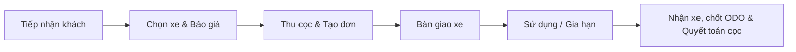

# HIMOTO Fleet Dashboard — Hướng Dẫn Sử Dụng (User Guide)

Tài liệu hướng dẫn vận hành chuẩn hóa cho đội ngũ quản trị, quản lý chi nhánh và nhân viên vận hành hệ thống HIMOTO Fleet Dashboard.

---

## 1. Đăng Nhập & Phân Quyền Hệ Thống

### 1.1. Đăng nhập
1. Truy cập địa chỉ hệ thống (ví dụ: `https://himoto-web.onrender.com` hoặc tên miền chính thức).
2. Nhập **Email** và **Mật khẩu** được cấp.
3. Bấm **Đăng nhập**. Hệ thống cấp mã xác thực JWT và chuyển hướng đến màn hình phù hợp theo vai trò.

### 1.2. Phân quyền người dùng (User Roles)
- **Role 1 (Quản trị viên / Admin):** Toàn quyền truy cập tất cả chi nhánh, quản lý xe, đơn hàng, khách hàng, nhân sự, bảng giá và sổ quỹ tài chính.
- **Role 2 (Quản lý chi nhánh):** Quản lý xe, đơn thuê và quỹ trong phạm vi chi nhánh phụ trách.
- **Role 3 (Nhân viên vận hành):** Tạo đơn thuê, giao xe, nhận trả xe, kiểm tra ODO và tình trạng xe.
- **Role 4 (Tư vấn Lead / Sale):** Tự động chuyển hướng đến `/leads` khi đăng nhập; tiếp nhận nhu cầu thuê, tư vấn và chuyển đổi thành đơn hàng.

---

## 2. Quản Lý Đội Xe (Vehicles) — `/vehicles`

### 2.1. Tra cứu & Lọc danh sách xe
- **Chế độ xem:** Hỗ trợ chuyển đổi linh hoạt giữa dạng lưới (Card Grid) và dạng bảng (Table View).
- **Bộ lọc nhanh:**
  - Lọc theo chi nhánh cửa hàng.
  - Lọc theo trạng thái xe:
    - `ready` (Sẵn sàng cho thuê — Huy hiệu xanh lá).
    - `using` (Đang được thuê — Huy hiệu đỏ thương hiệu).
    - `repairing` (Đang bảo dưỡng/sửa chữa — Huy hiệu cam).
    - `broken` (Xe hỏng chờ xử lý — Huy hiệu xám).
  - Tìm kiếm theo tên xe hoặc biển kiểm soát (ví dụ: `29B1-888.88`).

### 2.2. Ngăn kéo thông tin xe (Inspection Drawer)
- Bấm vào bất kỳ card xe hoặc hàng dữ liệu nào để mở **Himoto Inspection Drawer** bên phải màn hình.
- Hiển thị đầy đủ: Biển số, số km hiện tại (ODO), giá thuê ngày, chi nhánh lưu đỗ và tình trạng kỹ thuật.
- Bấm nút **"Thuê xe"** để chuyển thẳng vào luồng tạo đơn thuê cho xe đã chọn.

---

## 3. Quản Lý Đơn Thuê Xe (Orders) — `/car-rental`

### 3.1. Quy trình thuê xe tiêu chuẩn

1. **Khởi tạo đơn hàng:**
   - Chọn khách hàng thuê xe (tìm theo SĐT hoặc CCCD).
   - Chọn xe sẵn sàng trong kho chi nhánh.
   - Nhập ngày bắt đầu thuê và ngày hẹn trả.
2. **Đặt cọc & Thanh toán:**
   - Nhập tiền cọc ban đầu (`first_deposit_amount`).
   - Chọn hình thức thanh toán: Tiền mặt hoặc Chuyển khoản ngân hàng.
   - Hệ thống tự động ghi nhận giao dịch vào sổ quỹ tương ứng.
3. **Trả xe & Quyết toán:**
   - Kiểm tra số km thực tế (ODO) khi nhận xe.
   - Tính toán chi phí phát sinh (nếu có: quá giờ, phụ phí hư hỏng).
   - Quyết toán hoàn trả cọc (`refund_amount`) cho khách hàng và hoàn tất đơn.

---

## 4. Quản Lý Khách Hàng (Customers) — `/customers`

- **Tìm kiếm:** Tra cứu theo tên khách, số điện thoại hoặc số CCCD/CMND.
- **Tạo mới hồ sơ khách (`/customers-create`):**
  - Nhập thông tin định danh: Họ tên, số CCCD, ngày cấp, nơi cấp, địa chỉ thường trú.
  - Tải lên ảnh chụp 2 mặt CCCD và Giấy phép lái xe (GPLX).
- **Cảnh báo rủi ro:** Hệ thống tự động gắn nhãn cảnh báo đối với khách hàng từng có lịch sử nợ xấu hoặc vi phạm hợp đồng thuê.

---

## 5. Quản Lý Khách Tiềm Năng (Leads) — `/leads`

- Quản lý các liên hệ từ website, Facebook Ads, Zalo OA hoặc Hotline.
- **Trạng thái:** Chờ xử lý (`pending`), Đang liên hệ, Đã chốt hoặc Hủy.
- **Phân công nhân sự:** Gán nhân viên phụ trách trực tiếp cho từng lead.
- **Chuyển đổi thành đơn:** Nút "Tạo đơn từ Lead" tự động điền sẵn thông tin khách hàng vào màn hình đơn thuê xe.

---

## 6. Lịch Bảo Dưỡng (Maintenance) — `/maintenance-schedule`

- Tự động nhắc nhở xe sắp đến kỳ thay dầu máy hoặc bảo dưỡng định kỳ dựa trên số km (ODO) và chu kỳ ngày.
- Ghi nhận chi phí bảo dưỡng vào lịch sử kỹ thuật của xe.

---

## 7. Quản Lý Sổ Quỹ Tài Chính — `/cash` & `/banks`

- **Sổ quỹ tiền mặt (`/cash`):** Theo dõi tiền mặt thực tế tại két từng chi nhánh; ghi nhận tức thời khi nhân viên thu tiền cọc hoặc chi tiền hoàn trả cọc.
- **Sổ quỹ ngân hàng (`/banks`):** Theo dõi số dư tài khoản ngân hàng công ty và các khoản thanh toán chuyển khoản QR Code.
